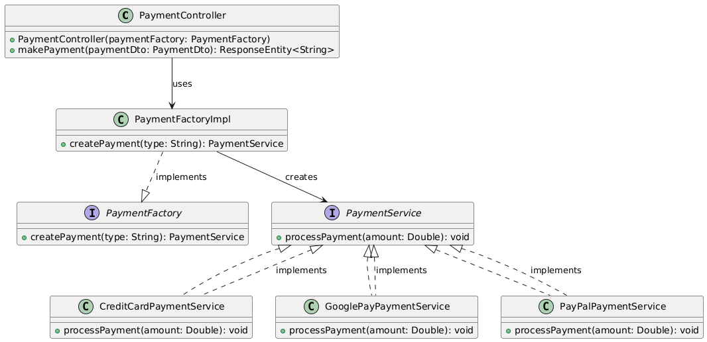

# Simple Factory Pattern in Spring Boot
This project demonstrates the implementation of the Simple Factory Pattern using Spring Boot. The Simple Factory Pattern is a design pattern that
provides a way to encapsulate the creation logic of various related objects, allowing clients to interact with these objects without needing to
understand the details of their instantiation.



## Simple Factory Pattern Explained
The Simple Factory Pattern is a creational design pattern that abstracts the instantiation process of objects. In this project:

- The **PaymentFactory** interface defines a method to create payment objects.
- The **PaymentFactoryImpl** class implements this interface, providing the logic to return specific types of payment objects based on the input
  provided.

For example, when a request is made to the PaymentController, it delegates the creation of the appropriate payment type (e.g: credit-card, google-pay,
paypal-pay) to the PaymentFactoryImpl, which returns the correct object instance.
<br/>This pattern helps in reducing the dependency on specific classes and promotes loose coupling between components.

---

## Features
- **Simple Factory Pattern:** Encapsulates the creation of payment objects through a factory class.
- **Spring Boot Integration:** Utilizes Spring Boot to create a REST API that interacts with the factory.
- **Lombok:** Reduces boilerplate code with automatic generation of getters, setters, and other methods.

## Project Structure
- **PaymentController:** This class exposes REST endpoints to interact with the payment system. It uses the `PaymentFactory` to create and process
  different types of payments.
- **PaymentFactory:** An interface that defines the contract for creating different types of payment objects.
- **PaymentFactoryImpl:** A concrete implementation of the `PaymentFactory` interface that uses the Simple Factory Pattern to instantiate and return
  specific payment objects based on input parameters.

## Dependencies
The project includes the following key dependencies:
- **Spring Boot Starter Web:** Provides the web framework to build REST APIs.
- **Lombok:** Reduces boilerplate code in Java by generating commonly used methods automatically.
- **Spring Boot Starter Test:** Provides testing utilities and libraries for Spring Boot applications.

## Running the Application

1. **Clone the Repository:**
   ```bash
   git clone https://github.com/arianmtzcu/spring-boot-simple-factory-pattern.git
   cd spring-boot-simple-factory-pattern
   ```
2. **Build the Application**
   <br/> Use Maven to build the project:
   ```bash
   mvn clean install
   ```

3. **Run the Application**
   <br/> Start the application using the Spring Boot Maven plugin:
   ```bash
   mvn clean install
   ```

4. **Access the API**
   <br/> You can interact with the application via the following endpoint:
    - **POST .../api/payment/make** - Create and process a payment<br/><br/>

5. **Example:**
   ```bash
   curl -X POST http://localhost:8080/payment -d '{"type":"credit","amount":100.0}'
   ```

## Contributions
This project is open to contributions. If you'd like to collaborate, please open an issue or send a pull request.

## License
This project is licensed under the MIT License. See the [LICENSE](https://opensource.org/license/MIT) file for more details.